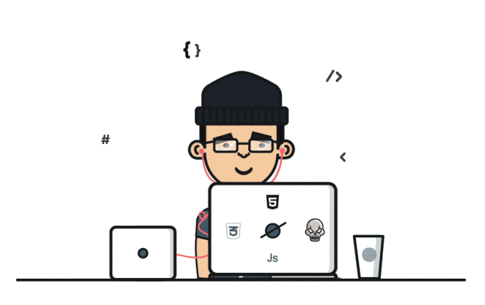

<h1 align="center">Hi 👋, I'm Chamal Dissanayake</h1>
<h3 align="center">A passionate full stack developer</h3>

  

- 🔭 I’m currently working on [Food Ordering System Windows Application](https://github.com/chamal-dissanayake/Food-Ordering-System-Windows-Application)

- 🌱 I’m currently learning **Frameworks, courses etc.**

- 👯 I’m looking to collaborate on [E-Commerce Web Site](https://github.com/chamal-dissanayake/E-Commerce-Web-Site-)

- 🤝 I’m looking for help with [E-Commerce Web Site](https://github.com/chamal-dissanayake/E-Commerce-Web-Site-)

- 👨‍💻 All of my projects are available at [https://github.com/chamal-dissanayake](https://github.com/chamal-dissanayake)

- 💬 Ask me about **MERN Stack**

- 📫 How to reach me **chamalpriyanath457@gmail.com**

- ⚡ Fun fact **Did you know that the first computer programmer was a woman named Ada Lovelace? She wrote the first algorithm in the mid-1800s, even before the first computer was built! 🤔🤔**

<h3 align="left">Connect with me:</h3>

<h3 align="left">Languages and Tools:</h3>

                           

# 📊 GitHub Stats:
 
 

## 🏆 GitHub Trophies

### ✍️ Random Dev Quote

### 😂 Random Dev Meme

<!-- Proudly created with GPRM ( https://gprm.itsvg.in ) -->

